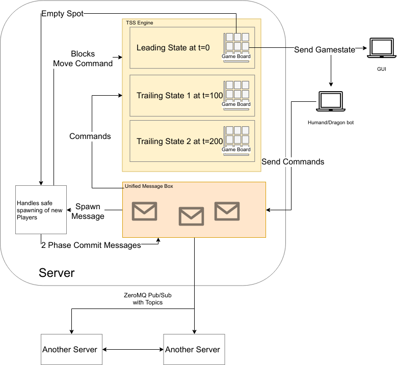

# Dragons Arena Design Document

# Game Flow
## Client
### Dragon/Human
- chose randomly one server as there main connection to the game
- listen to the publisher of that server
- topic alive: if the no answer for two long switch over to another server
- has unique id which does not change after restart (may be uuid written to file)
- sends spawn message after start
- runs bot
- but starts sending commands once it sees it's own id in the received gamestate

### GUI
- chose one server for gamestate
- renders gamestate and closes gui after receiving game over state

## Server
- after server startup it tries to commit to one chosen beginning timestamp from which the internal clock starts 
- has one publisher (for possible commands see [README.md](README.md))
- has one server for receiving commands of connected clients (connection is stateless)
- when receiving a normal command (except spawn). Tag it with internal clock and publishes it. 
- has message buffer which is emptied after the TSS if in the past
- has a TSS engine which runs the game with a difference of 100ms each
- has spawning component which runs outside the TSS engine and looks for a free spot in the leading state and proposes this to the others. This component buffers the spawning messages till it has chosen a start time.

### handling server fault
- server publishes heartbeat per gameloop
- if the other server don't hear anything for a certain time they exclude the server from voting for new

- on server restart the server waits for the heartbeats of other servers, when one has a valid timestamp then it know that he was down.
- has to queue all messages it listens from the other server till it got the past gamestate of the other server
  - either get a copy of the gamestate
  - or get the history of all commands and make a replay

# Modules Organization

The source codes are organized following Python module packages structure. They are organized into 4 main directories:
1. common
2. server
3. client
4. img

## common

This directory is used to store modules that are used both by server and client.

### Character, Human, and Dragons

These classes are reprentations of the characters in the game. Their important properties are: type (human or dragon), HP, max HP, AP, and location (x,y).

### GameBoard

This class stores the 25x25 game board grids state. The characters' objects are referred from the grids.

### GameState

This class stores gameboard and also the characters involved in a game. The GameState should always know how many players are still alive. If needed, this class can also contain the offline players list data.

### JSONEncoder

This class functions to serialize and deserialize GameState object to JSON format.

### SocketWrapper

This class functions to "wrap", i.e. enhance, `recv()` function in ZeroMQ to raise a timeout error.

## server

This directory is used to store server related modules. The modules in this class are described in the following subsections.

### Modeller Classes

#### TSSModel

TSSModel is a class responsible to contain:
* all gamestates,
* is_game_running flag,
* start time from epoch in milliseconds, and,
* running game clock.

In this class, the actual representation of three game states (leading, trailing01, and trailing02) of GameState object is stored. This class should not do any work by itself, and is only modified by server's controller/worker classes.

#### ClientMessageBox

This class is used to store messages coming from clients and peer servers to be used at later time by other classes.

### Controller/worker Classes

#### Server

This class is the container class for all modeller and worker classes in the server module. It initializes them and wait until the game is finished.

#### GameClockManager

This class is responsible to advance the gameclock every 10ms, do winning condition checking in the TSSModel every 300ms, and clearing ClientMessageBox every 500 ms.

#### GameStatePublisher

This class is responsible to broadcast the gamestates and game running state to the clients and observers connected to it. It creates a ZeroMQ PUB queue, reads the gamestate from the TSSModel, and put the gamestates into the queue every 300ms.

#### ClientCommandManager

This class creates a ZeroMQ REP and waits for action commands from the clients. If it receives action commands from any clients, it will give an ack to the client, send the command to ServerCommandDuplicator (which in turn will distribute the command to server peers), execute the command in the leading state, and save the commands in the ClientMessageBox instance. It should do all checking if a command is valid or not.

#### ServerCommandDuplicator

This class is responsible to duplicate commands received from the clients to peer servers and execute commands received from the peer servers in the TSSModel. (Adi's note: should it be the class that do TSS trailing execution as well? or just create another one?)

## client

This directory is used to store client related modules.

### Modeller Classes

There is no modeller class in this modules, *the client should be strictly stateless*.

### Controller/worker Classes

#### Client

This class as a container for other client classes and also instantiates the GameStateUpdater and ClientSideCommandSender. After that, it only waits until the game running state (which is periodically updated by GameStateUpdater) is finished.

#### Bots

This class reads the gamestate from GameStateUpdater, calculate next move, and finally send the action command via ClientSideCommandSender.

#### ClientSideCommandSender

This class is responsible to send the commands from bot to the server. The corresponding class in server is the ClientCommandManager class.

#### GameStateUpdater

This class read message published by the server via ZeroMQ SUB queue and update the gamestate accordingly.

#### GUIDisplay

This class reads the gamestate from GameStateUpdater and displays it to screen using pygame screen. The GUI should run in the main process and not on thread (otherwise it will crash in MacOS).

#### Observer

This class simply instantiate GUIDisplay.

## img

This directory is to store images only, whether for documentation or used in game.

