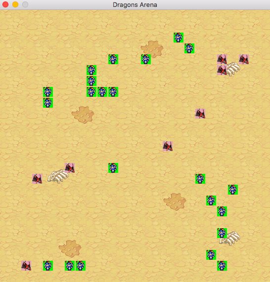

# Dragons Arena: Warriors vs Dragons RTS Game

Dragons Arena is online warfare game between computer-controlled dragons and hundreds of virtual knights (avatars or real-life humans).
This game is developed as an labwork assignment in [TU Delft's](https://www.tudelft.nl/) IN4391 *Distributed Computing Systems* course. The course is/was scheduled in Q3 of academic year 2017/18.

Dragons Arena employs Trailing State Synchronization [^1] algorithm to synchronize action messages between peer-to-peer servers.

The comprehensive design of this game is available in the [design document](DESIGN.md).

[^1] Eric Cronin, Burton Filstrup, Anthony R. Kurc, and Sugih Jamin, An efficient synchronization mechanism for mirrored game architectures, NETGAMES, 2002.

# Usage



We have at most 5 mirrored server components.
Various parameters can be configured in `common/setting.py`.

All of the commands below should be run from the root directory of `dragonsarena`.


For starting the first server:

```
python -m server.run_server 1
```

Preferably in another session, start the second server:

```
python -m server.run_server 2
```

For starting a bunch of dragon and human bots plus an additional bot with gui

```
./battle.sh
```

Emergency stop command to stop the game (hopefully not needed), tested in Mac OS, might need some mods in other OS

```
./unbattle.sh
```

Other than that, to start an observer manually we can use this command:

```
python -m client.Observer <idx of server_list>
example:
python -m client.Observer 0
```

To start a human player manually:

```
python -m client.run_client <player_type> <player_id> <idx of server_list>
example:
python -m client.run_client human id_5 1
```

To start a dragon player manually:

```
python -m client.run_client dragon
```
